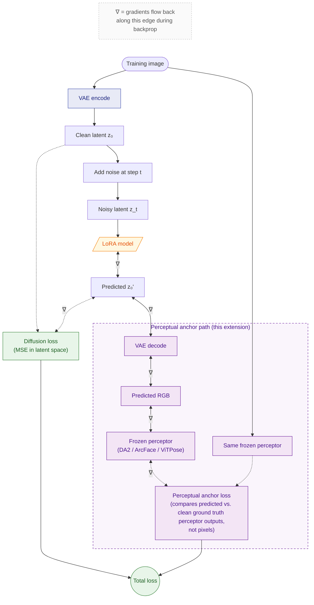

# Perceptual LoRA Toolkit

An extension of [AI Toolkit by Ostris](https://github.com/ostris/ai-toolkit) that adds **perceptual anchoring** to LoRA training. The idea is straightforward: instead of training only on per-pixel match against your dataset, you also tell the LoRA to match specific properties of those images using pre-trained vision models. There's an anchor for depth (the geometric structure of a scene), one for facial identity, one for body proportions, and a face-suppression option for when you don't want faces baked in at all. The depth anchor is the most useful one in practice. It lets the LoRA pick up the shapes in your dataset without locking in the colors, textures, or lighting, so trained models stay sharper on small datasets and generalize better to new prompts.

**Supported models:** SDXL, FLUX.2 Klein 9B

## Contents

- [Perceptual Anchoring](#perceptual-anchoring): depth, identity, body, face suppression
- [Auto-Masking](#auto-masking): body / clothing / subject masks for region-weighted loss
- [Reg Dataset Semantics](#reg-dataset-semantics): how reg samples are treated in this extension
- [Training Metrics](#training-metrics): what gets logged each step
- [Training Previews](#training-previews): what each anchor saves to disk
- [Dataset-Tools UI](#dataset-tools-ui): preflight passes for masks, depth, faces
- [Example: Sketchwave Style (single-image style LoRA)](#example-sketchwave-style-single-image-style-lora)
- [Example: Yoshitaka Amano Style (small-dataset style LoRA)](#example-yoshitaka-amano-style-small-dataset-style-lora)
- [Example: Handsome Squidward (single-image LoRA)](#example-handsome-squidward-single-image-lora)
- [Configuration Reference](#configuration-reference): every extension-specific config option
- [Upstream: AI Toolkit by Ostris](#upstream-ai-toolkit-by-ostris)
- [Installation](#installation)

## Perceptual Anchoring

The standard LoRA training loss is per-pixel MSE in latent space. It tells the model "match this exact image." On small datasets that turns into a strong instruction to memorize, which is why you often see washed-out colors, baked-in lighting, and "burn-in" (stippling, JPEG ghosts) showing up in every generation.

Perceptual anchors give the LoRA more targeted guidance. Each one is a frozen vision model that scores a single property of the generated image, like its depth or its facial identity, and the LoRA gets rewarded for matching the training images on that property alone. You pick which properties matter for what you're training.



The anchor path (purple) is what this extension adds. Both the GT image and the LoRA's prediction go through the **same frozen perceptor**, and the loss is computed on its outputs (a depth map for DA2, a face embedding for ArcFace, a keypoint heatmap for ViTPose). Gradients flow back through the perceptor and VAE decoder, translating the perceptual loss into a **latent-space update** for the LoRA. The weights most strongly nudged are the ones whose latents most affected the property the perceptor measures (depth, identity, pose); others barely move. Loss splitting (described below) takes this further by running the diffusion-loss step and the anchor-loss step alternately rather than summing them every step.

### Depth-Consistency Anchor

Tells the LoRA to keep the geometric structure of the training images while ignoring everything else. It separates "what's in the scene" (which is the LoRA's job) from "how it looks in this particular photo" (which can be left to the model's prior). Useful for:

- **Subject LoRAs that generalize.** The model learns the subject's shape and pose without baking in the outfit, lighting, or backdrop of each training photo.
- **Style transfer** that keeps scene composition but changes appearance.
- **Reducing texture burn-in and stippling** on small datasets. Depth doesn't reinforce per-pixel artifacts, so fine-detail memorization slows down a lot.

Powered by Depth-Anything-V2 (Small by default; Base or Large can be selected for stronger geometry).

**Quick start:**

```yaml
depth_consistency:
  loss_weight: 0.1                       # default; 0 disables
  model_id: depth-anything/Depth-Anything-V2-Small-hf
  mask_source: subject                   # 'none' | 'subject' | 'body'
  loss_min_t: 0.0
  loss_max_t: 1.0
  preview_every: 100
```

The default of `0.1` is calibrated for **DA2-Small** (the default perceptor). If you switch to **DA2-Large**, drop the weight to around `0.001`, since the larger model produces much higher-magnitude gradients and `0.1` will overpower the diffusion loss. **DA2-Base** sits between the two; start at `0.01` and tune from there. If outputs look washed-out, over-smoothed, or the LoRA seems to be ignoring color and texture, the depth weight is too high. Halve it and retry.

**Per-dataset overrides** (handy when different folders need different strengths):

```yaml
datasets:
  - folder_path: /path/to/portraits
    depth_loss_weight: 0.2               # stronger structure on portraits
    depth_loss_min_t: 0.5                # only fire on noisy timesteps for this set
```

Ground-truth depth maps are cached automatically at job start, so the anchor adds no per-step preprocessing cost once training begins.

**Loss splitting (strongly recommended for most cases).** When the diffusion loss and depth anchor pull in different directions, having them fire on alternating optimizer steps instead of competing every step turns out to work better than running them together for almost every workflow we've tested. Set it on the dataset:

```yaml
datasets:
  - folder_path: /path/to/data
    loss_split: diffusion_depth
```

This separates structure-learning (depth) from appearance-learning (diffusion) into distinct optimizer steps. In practice it acts as a strong implicit regularizer against burn-in: fine-texture parameters update much more slowly than coarse-structure parameters, since the two losses only really agree on the latter. Try it before tuning weights or other knobs.

### Identity Anchor (ArcFace)
Keeps the trained subject's face recognizable across poses, expressions, and lighting. Useful when you're training on diverse appearances of the same person and the diffusion loss alone isn't enough to lock in identity. Recommended weight: **0.01 to 0.1**.

### Body Proportion Anchor (ViTPose)
Keeps body proportions (limb lengths, torso ratio) consistent with the training images. Useful for full-body subject LoRAs where the body shape should stay recognizable across generated poses. Recommended weight: **0.1 to 0.2**.

### Face Suppression
The inverse of the identity anchor: it tells the LoRA to *ignore* faces. The diffusion loss is downweighted (or zeroed) inside detected face regions, so the model doesn't learn to reproduce the faces in your dataset. Use this when training a style or clothing LoRA on a dataset that happens to contain people, and you want the style or outfit but not the faces.

Set `face_id.face_suppression_weight` between `0` (off) and `1` (full suppression). Per-dataset overrides are supported.

### Quick-start config

```yaml
depth_consistency:
  loss_weight: 0.1                       # primary anchor (DA2-Small default; use 0.001 for DA2-Large)
face_id:
  identity_loss_weight: 0.1              # secondary
  body_proportion_loss_weight: 0.1       # secondary
  face_suppression_weight: 0.5           # optional
  identity_metrics: true                 # log id_sim without applying loss
```

Per-dataset overrides let you tune each anchor for the dataset's content:

```yaml
datasets:
  - folder_path: /path/to/portraits
    depth_loss_weight: 0.2               # stronger structure on portraits
    identity_loss_weight: 0.1            # stronger face on close-ups
  - folder_path: /path/to/fullbody
    body_proportion_loss_weight: 0.15    # preserve body shape
    face_suppression_weight: 1.0         # full suppression, don't learn faces
```

See `config/examples/train_lora_flux_identity_24gb.yaml` for a complete example.

## Auto-Masking

Splits each training image into regions (body, clothing, and subject = body ∪ clothing) so different parts of the image can be weighted differently in the loss. Useful for:

- **Subject LoRAs** that should focus on the person, not the background. Set the background weight low and the body weight high.
- **Clothing LoRAs** that should learn outfit details while ignoring face and body.
- **Letting the depth anchor focus on the subject** instead of computing depth-consistency over the whole image, where most of the frame is usually background you don't care about.

Masks are generated per image at job start and cached.

```yaml
subject_mask:
  enabled: true
  body_close_radius: 5
```

```yaml
datasets:
  - folder_path: /path/to/data
    background_loss_weight: 0.3
    clothing_loss_weight: 0.7
    body_loss_weight: 1.0
    perceptual_restrict_to_body: true    # restrict perceptual anchors to body region
```

The depth anchor picks which mask it uses via `depth_consistency.mask_source` (`subject`, `body`, or `none`).

QC tiles for visual inspection are saved at job start and can be regenerated from the dataset-tools UI.

## Reg Dataset Semantics

Reg datasets (`is_reg: true`) work the classic Dreambooth way: they're prior-preservation samples that train the model on generic non-subject images alongside your subject samples, so it doesn't forget how to make non-subject content while it's learning the subject. In this extension, reg semantics are tightened up:

- **All perceptual anchors are turned off on reg samples.** Only the diffusion loss fires, scaled by `train.reg_weight`.
- **Subject conditioning is stripped.** No clip-image or trigger-word injection.

The effect is that reg samples teach the model "produce sharp prior-distribution images" without contaminating any of the subject-specific anchors. The 50/50 reg/train alternation runs at the optimizer-step level, so the gradient stays clean under any accumulation setting. `train.reg_weight` (default `1.0`) controls how strongly reg pulls vs. train.

## Training Metrics

Every active loss is logged so you can see during a run whether each anchor is doing its job. The training UI shows live charts plus per-sample tooltips on each point (which images drove the loss this step).

| Metric | What it tells you |
|---|---|
| `diffusion_loss` | How well the model is matching training images per-pixel. Watch for it bottoming out, which usually means memorization. |
| `diffusion_loss_tNN` | Diffusion loss broken down by timestep band (`t00` through `t90`). Useful for spotting whether low-noise or high-noise timesteps are dominating. |
| `depth_consistency_loss` | How well the predicted geometry matches the training images. Should fall steadily; if it goes flat, the depth anchor isn't converging. |
| `depth_loss_tNN` | Depth loss per timestep band. |
| `id_sim` | Face cosine similarity (higher is better). Set `face_id.identity_metrics: true` to log this without applying the loss. |
| `id_sim_tNN` | Per-timestep face similarity. |
| `body_proportion_loss` | Pose-proportion error. |
| `grad_norm` | Total gradient magnitude post-clip. Spikes usually mean a loss explosion. |
| `grad_norm_diffusion`, `grad_norm_depth`, `grad_cos_diff_depth` | Optional gradient-cosine diagnostic. See below. |

**Gradient-cosine diagnostic.** When you suspect two anchors are pulling in opposite directions, this measures how aligned their gradients are. Cosine near +1 means they reinforce each other, near 0 means they're independent, negative means they're fighting. Off by default; enable with `train.gradient_cosine_log_every: 50`.

## Training Previews

Visual previews are saved during training so you can see at a glance what each anchor is responding to.

| Directory | What you see |
|---|---|
| `depth_previews/` | Side-by-side comparison of GT image, GT depth, predicted image, and predicted depth. Annotated with timestep and depth-loss value so you can scroll through training and watch the geometry converge. |
| `id_previews/` | What the identity anchor is seeing: the face crop being scored, alongside the noisy input and the model's x0 prediction, with the cosine similarity overlaid. |
| `body_previews/` | Skeleton overlays for reference vs. predicted poses. |
| `subject_mask_previews/` | Mask QC: each image with its body, clothing, and subject masks overlaid, generated once at job start. |

## Dataset-Tools UI

Before training, the web UI provides preflight passes that prepare the cached data each anchor needs:

- **Depth preflight.** Runs depth estimation across the dataset and shows visual QC tiles so you can spot bad masks or odd crops before they cost you a training run.
- **Subject-mask preflight.** Generates and caches the body, clothing, and subject masks with overlays for review.
- **Face-detection preflight.** Caches face bounding boxes and identity embeddings.

All three run as non-blocking background jobs. Start them and come back when they're done.

The `scripts/sample_dataset.py` utility builds a smaller dataset directory by sampling N random images (with their captions) from a larger source. Useful for building reg sets, running ablations, or making smoke-test datasets without copying everything.

## Example: Sketchwave Style (single-image style LoRA)

Single-image LoRA training, but for a style instead of a specific subject. One training image, one caption, and the LoRA picks up an entire visual vocabulary.

Sketchwave is a specific look: sketchy graphite-style linework over warm cream paper, with restricted earthy palettes (olive-green, ochre, wine-red, sepia) and slightly painterly shading. There's one training image, a portrait. The goal is for the LoRA to apply the look to anything the base model can paint, including subjects with nothing in common with the portrait.

Dataset layout:

```
examples/sketchwave/dataset/
├── 1.webp     # single training image
└── 1.txt      # caption
```

The caption opens with the trigger phrase `sketchwave style.` and then describes the image in detail: figure, clothing, lighting, and an explicit enumeration of the palette ("warm cream-yellow background, tan-and-ochre skin, dark sepia-brown linework, dark brown-black hair..."). Calling out the palette is deliberate. In LoRA training, anything you describe in the caption stays controllable at inference, while anything you leave out becomes part of what the trigger word bakes in. Naming the colors here teaches the LoRA that those are content choices in this particular image, not the essence of sketchwave style itself, so the trigger applies later with whatever palette you prompt for.

The training image itself:

|  |
|:---:|
| The single training illustration. |

Full config is at [`examples/sketchwave/config.yaml`](examples/sketchwave/config.yaml). Key bits:

- LoKr, linear/alpha 32, conv/alpha 16, full-rank, factor 8.
- 1200 steps, batch size 1, gradient accumulation 2.
- Resolution 768.
- 1 image, `num_repeats: 50`.
- Depth anchor: weight `0.005`, DA2-Large at `input_size: 1400`, `mask_source: none`.
- Loss splitting on the dataset (`loss_split: diffusion_depth`).

The interesting part is how the trained LoRA generalizes. None of these outputs share a subject with the training image. The LoRA carries the linework, palette, and paper-like shading onto identities and scenes with nothing in common with the training portrait, including an animal and an outdoor landscape:

| New portrait | Different woman | Sleeping fox | Lakeside scene |
|:---:|:---:|:---:|:---:|
|  |  |  |  |

To reproduce:

```bash
python run.py examples/sketchwave/config.yaml
```

Edit `model.name_or_path` in the config to point at your local Flux 2 Klein checkpoint first.

## Example: Yoshitaka Amano Style (small-dataset style LoRA)

A working example of depth-anchored fine-tuning on an **artist's style** rather than a specific subject, on a **small dataset** of 14 illustrations. Yoshitaka Amano is the illustrator behind the original Final Fantasy character art and a long-running body of solo watercolor portrait work. Flux 2 Klein 9B doesn't reproduce his look from a prompt alone; it defaults to generic anime or oil-paint stylings.

**The reference style.** One illustration from the dataset is shown below to give a feel for what the LoRA is asked to learn: loose ink linework, watercolor washes, ornate costuming, hair drawn as long flowing tendrils.

|  |
|:---:|
| One of the 14 training illustrations. |

**The config.** Key settings (full config at `output/amano/config.yaml` after a run):

- **Network:** LoKr, linear/alpha 32, conv/alpha 16, full-rank, factor 8.
- **Steps:** 4000, batch size 1, gradient accumulation 2.
- **Resolution:** 768.
- **Depth anchor:** `loss_weight: 0.005`, `model_id: depth-anything/Depth-Anything-V2-Large-hf`, `input_size: 1400`, `mask_source: none`.
- **Loss splitting:** `loss_split: diffusion_depth` on the dataset, so depth and diffusion fire on alternating optimizer steps.

**Watching the depth anchor work.** The ground-truth pair (RGB | depth) is shown once at the top; the predicted pair (RGB | depth) is shown for an early and late step at a comparable noise level. Early on, the predicted depth has heavy halo artifacts and doesn't track the figure cleanly; by the end of training it's a much closer match to the GT depth.

**Ground truth** (RGB | depth)


**Early prediction (step 383, t=0.82)** `depth_consistency_loss: 17.17`


**Late prediction (step 3941, t=0.81)** `depth_consistency_loss: 6.67`


**Generalizing past the dataset.** None of these subjects appear in the training set. The LoRA carries Amano's linework, color treatment, and composition language onto subjects from very different IPs:

| Cloud (FF7) | Snow White (Disney) | Ziggy Stardust (Bowie) |
|:---:|:---:|:---:|
|  |  |  |

**Why depth anchoring matters here.** With a style dataset this small, the diffusion loss alone tends to overfit on the specific compositions of the training images; every output starts looking like a slight variation on the same handful of poses and figures. The depth anchor pushes the LoRA toward what's invariant across the artist's work (linework, paper texture, color treatment) and away from what's incidental (this exact figure, in this exact pose, against this exact background). Loss splitting reinforces the separation: the diffusion-step focuses on appearance, the depth-step on structure, and they only really agree on the high-level "this looks like Amano" signal.

## Example: Handsome Squidward (single-image LoRA)

A working example of depth-anchored fine-tuning on a character that isn't well represented in the base model, with a **one-image dataset**.

**The setup.** Handsome Squidward is a side character from a single SpongeBob SquarePants episode. Flux 2 Klein 9B doesn't reliably reproduce him out of the box; prompts default to regular Squidward or a confused human-squid hybrid. We trained a LoRA on a single official illustration to teach the model what he looks like, then tested whether the trained LoRA could generalize to angles and contexts that don't exist anywhere in the source material.

**The dataset.** One image, one caption.

```
examples/squidward/dataset/
├── 1.webp     # single training image
└── 1.txt      # caption
```

The caption: *"a cartoon illustration of handsome squidward. he is standing confidently with his arms flared and his tentacle-hands on his hips. he is wearing a tight yellow shirt with a brown belt and gold buckle. he has four legs, two on each side close together. his legs are spread apart. there is a logo at the bottom of the frame."*

**The config.** [`examples/squidward/config.yaml`](examples/squidward/config.yaml) is the full training config. Key settings:

- **Network:** LoKr, linear/alpha 32, conv/alpha 16, full-rank, factor 8.
- **Steps:** 1200, batch size 1, gradient accumulation 2.
- **Dataset:** 1 image, `num_repeats: 50`.
- **Depth anchor:** `loss_weight: 0.005`, `model_id: depth-anything/Depth-Anything-V2-Large-hf`, `input_size: 1400`. The lower weight matches the larger perceptor's higher gradient magnitude (see the depth-anchor section above).
- **Loss splitting:** `loss_split: diffusion_depth` on the dataset, so depth and diffusion fire on alternating optimizer steps.
- **Mask source: none.** Single-character cartoon images with white backgrounds don't need masking.

**Watching the depth anchor work.** Each preview tile shows (GT RGB | GT depth | Pred RGB | Pred depth) side by side. At the start of training the predicted depth is unstructured noise; by the end it tracks the GT depth closely.

**Early (step 21)** `depth_consistency_loss: 26.6`


**Late (step 1199)** `depth_consistency_loss: 1.6`


**Generalizing past the dataset.** The training image is a confident front-three-quarter pose. Generations from the trained LoRA hold the character identity in poses, framings, and contexts that don't exist in the source material:

| | |
|:---:|:---:|
|  |  |

The first output is a near-direct front view, and there is no front-view reference anywhere in the source material, let alone the dataset. Both outputs maintain the character's distinctive identity (chiseled face, squid morphology, the specific drawn-on aesthetic) while placing him in contexts the LoRA wasn't trained on.

**Why it works.** From a single image, per-pixel diffusion MSE alone would just memorize the training photo. The depth anchor adds a structural objective that gets reinforced on the same one image, so the LoRA picks up a 3D-ish understanding of the character's shape that lets it interpolate to unseen angles. Loss splitting keeps the diffusion and depth gradients from interfering with each other, which dramatically reduces the texture burn-in that's the typical failure mode of one-shot LoRAs.

**To reproduce:**

```bash
python run.py examples/squidward/config.yaml
```

Edit `model.name_or_path` in the config to point at your local Flux 2 Klein checkpoint before running.

## Configuration Reference

Every extension-specific config option, grouped by the YAML block it lives in. Defaults shown match what you get if you omit the option entirely.

### `depth_consistency.*`

The depth anchor.

| Option | Default | What it does, when to use it |
|---|---|---|
| `loss_weight` | `0.1` | Master switch. `0` disables. `0.1` is calibrated for DA2-Small (the default perceptor). Drop to ~`0.001` if you switch to DA2-Large, since it produces much higher-magnitude gradients. If outputs look washed-out or over-smoothed, halve the weight and retry. |
| `model_id` | `Depth-Anything-V2-Small-hf` | Which DA2 variant. Small is fast and adequate for most subjects. Base or Large give cleaner depth on cluttered scenes at higher VRAM cost. **Lower the loss weight when using a larger model** (Base ~`0.01`, Large ~`0.001`). |
| `mask_source` | `subject` | Which mask the loss applies through. `subject` is recommended for subject LoRAs (loss restricted to the person). `body` excludes clothing. `none` uses the full image. |
| `loss_min_t` | `0.0` | Lower edge of the timestep window where the depth anchor fires. |
| `loss_max_t` | `1.0` | Upper edge of the timestep window. Narrow to mid-high (e.g. `0.5` to `0.9`) to focus the anchor on the identity-encoding noise band. |
| `ssi_weight` | `1.0` | Scale-and-shift-invariant L1 term weight. Rarely needs tuning. |
| `grad_weight` | `0.5` | Multi-scale gradient term weight. Increase for more sensitivity to fine geometric structure. |
| `grad_scales` | `4` | Number of pyramid scales for the gradient term. Rarely needs tuning. |
| `input_size` | `518` | DA2 input resolution. Must be a multiple of 14. Can go up to `1400` for the clearest depth maps, at proportionally higher VRAM and compute cost. The default `518` is a good balance for most setups; bump to `714` or `980` if you want sharper depth on detailed scenes, or `1400` for the maximum the perceptor will accept. |
| `grad_checkpoint` | `true` | Gradient checkpointing through the perceptor for memory savings. Leave on unless you're on huge VRAM. |
| `preview_every` | `100` | Save a depth preview tile every N steps to `depth_previews/`. Set to 0 to disable. |
| `preview_min_t` | `0.0` | Only save previews at timesteps at or above this. |

### `face_id.*`

The identity-related anchor losses.

| Option | Default | What it does, when to use it |
|---|---|---|
| `face_model` | `buffalo_l` | InsightFace model used for face detection and embeddings. Don't change unless you have a specific reason. |

**Identity anchor** (the loss that keeps face recognizable):

| Option | Default | What it does, when to use it |
|---|---|---|
| `identity_loss_weight` | `0.0` | Master switch. Typical 0.01 to 0.1. Higher locks in face shape harder, but too high constrains expressions. |
| `identity_loss_min_t` | `0.0` | Timestep window lower edge. |
| `identity_loss_max_t` | `1.0` | Timestep window upper edge. |
| `identity_loss_min_cos` | `0.2` | Minimum face similarity for the loss to fire on a sample. Below this, the predicted x0 likely doesn't contain a recognizable face yet, so the loss is skipped to avoid hallucinating one. |
| `identity_metrics` | `false` | Log `id_sim` without applying the loss. Useful for measuring identity drift in vanilla runs as a baseline. |
| `identity_loss_use_average` | `true` | Compare against the dataset's average face embedding instead of per-image. More robust on diverse training sets. |
| `identity_loss_average_blend` | `0.0` | Blend per-image with dataset average. 0 = per-image only, 0.5 = midpoint, 1.0 = pure average. |
| `identity_loss_use_random` | `false` | Compare against a random embedding from the dataset each step. Useful for mixed-identity training. |
| `identity_loss_num_refs` | `0` | If > 0, compare against K random embeddings and use best match. |

**Body proportion anchor** (ViTPose bone-length ratios):

| Option | Default | What it does, when to use it |
|---|---|---|
| `body_proportion_loss_weight` | `0.0` | Master switch. Typical 0.1 to 0.2. Use on full-body subject LoRAs where body shape should stay recognizable across poses. |
| `body_proportion_loss_min_t` | `0.0` | Timestep window lower edge. |
| `body_proportion_loss_max_t` | `1.0` | Timestep window upper edge. |
| `body_proportion_include_head` | `false` | Include head-related ratios. Off by default since identity anchor handles the head better. |

**Face suppression** (the inverse anchor; tells the LoRA to *not* learn faces):

| Option | Default | What it does, when to use it |
|---|---|---|
| `face_suppression_weight` | `null` | Master switch. `null` = no suppression. `0.0` = zero face loss (don't learn faces at all). `0.5` = half. `1.0` = normal. Use `0.0` for style or clothing LoRAs trained on photos with people. |
| `face_suppression_expand` | `2.0` | Multiplier on the face bounding box. `1.0` = tight face box, `1.8-2.0` = full head coverage. |
| `face_suppression_soft` | `false` | Gaussian falloff at the box edges instead of a hard rectangle. Smoother but slightly more invasive. |

### `subject_mask.*`

Auto-masking pipeline.

| Option | Default | What it does, when to use it |
|---|---|---|
| `enabled` | `false` | Master switch. Set true to extract per-image masks at job start. |
| `body_close_radius` | `2` | Morphological closing on the body mask. Higher values fill gaps in limbs and hair (e.g. `5` for blurry photos) at the cost of boundary precision. Changing this invalidates cached masks. |
| `mask_dilate_radius` | `0` | Outer dilation on the subject mask. Useful when you want a padding margin around the subject. |
| `skin_bias` | `0.0` | Bias added to body-class logits where skin tone is detected. Set to 1-3 if your dataset has lots of exposed skin and SegFormer is mislabeling it as clothing. |
| `save_debug_previews` | `false` | Save preview tiles per image. The dataset-tools UI preflight does the same thing on demand. |
| `segformer_res` | `768` | SegFormer input resolution. Don't change unless you know what you're doing. |
| `cache_resolution` | `256` | Cached mask resolution. Higher = sharper at training time, more disk. |
| `yolo_ckpt`, `yolo_conf`, `sam_size`, `dtype`, `primary_only` | (defaults) | Detection / segmentation backend knobs. The defaults work for almost everyone. |

### `train.*` (extension-specific additions)

| Option | Default | What it does, when to use it |
|---|---|---|
| `reg_weight` | `1.0` | Multiplier on diffusion loss for reg samples. `1.0` (equal pull) is the sane default. Increase to 1.5-2.0 if reg isn't preserving the prior strongly enough. |
| `gradient_cosine_log_every` | `0` | Diagnostic. Every N optimizer steps, measure `cos(g_diffusion, g_depth)` and log the per-loss gradient norms. `0` disables. Use 50-100 to diagnose anchor conflicts without much overhead. |
| `min_denoising_steps` | `0` | Lower bound on the timestep sampler (0-999). The training loop only samples from `[min, max]`. Useful for focused training, e.g. `min=700, max=700` to train at one specific noise level. |
| `max_denoising_steps` | `999` | Upper bound on the timestep sampler. |

### Per-dataset overrides (`datasets[].*`)

Every entry in `datasets:` accepts these extension-specific overrides. `null` or omitted = inherit the global value.

| Option | What it does, when to use it |
|---|---|
| `is_reg` | Mark this dataset as a regularization set. Strips subject conditioning and turns off all perceptual anchors on its samples. |
| `loss_split: diffusion_depth` | Strongly recommended for most cases. Alternates diffusion and depth-anchor on this dataset's samples per optimizer step (rather than running both every step). |
| `depth_loss_weight` | Per-dataset override of the depth anchor's `loss_weight`. Set to `0` to fully disable the depth anchor for this dataset (skips perceptor compute on its samples). |
| `depth_loss_min_t` / `depth_loss_max_t` | Per-dataset depth-anchor timestep window. |
| `depth_model_id` | Per-dataset DA2 variant. Useful if one dataset has unusual geometry that benefits from Large while others stay on Small. |
| `identity_loss_weight` / `_min_t` / `_max_t` / `_min_cos` | Per-dataset identity-anchor controls. Stronger weights on portrait crops, weaker on full-body. |
| `body_proportion_loss_weight` / `_min_t` / `_max_t` | Per-dataset body-proportion controls. Useful for full-body shots where pose proportions matter. |
| `face_suppression_weight` | Per-dataset face suppression. Per-dataset takes priority over global. |
| `background_loss_weight` / `clothing_loss_weight` / `body_loss_weight` | Per-region diffusion weight scaling. Used when `subject_mask.enabled` is true. Set background low (e.g. 0.3) and body high (1.0) to tell the LoRA to focus on the subject. |
| `perceptual_restrict_to_body` | Restrict perceptual-anchor losses to the body mask region for this dataset. |

---

## Upstream: AI Toolkit by Ostris

This extension is based on [AI Toolkit](https://github.com/ostris/ai-toolkit), an all-in-one training suite for diffusion models on consumer hardware.

### Support the Original Author

[Sponsor on GitHub](https://github.com/orgs/ostris) | [Support on Patreon](https://www.patreon.com/ostris) | [Donate on PayPal](https://www.paypal.com/donate/?hosted_button_id=9GEFUKC8T9R9W)


---


## Installation

Requirements:
- Python >3.10
- Nvidia GPU with enough VRAM for what you're training
- Python venv
- git

Linux:
```bash
git clone https://github.com/BuffaloBuffaloBuffaloBuffalo/ai-toolkit-perceptual.git
cd ai-toolkit-perceptual
python3 -m venv venv
source venv/bin/activate
# install torch first
pip3 install --no-cache-dir torch==2.7.0 torchvision==0.22.0 torchaudio==2.7.0 --index-url https://download.pytorch.org/whl/cu126
pip3 install -r requirements.txt
```

Windows:
```bash
git clone https://github.com/BuffaloBuffaloBuffaloBuffalo/ai-toolkit-perceptual.git
cd ai-toolkit-perceptual
python -m venv venv
.\venv\Scripts\activate
pip install --no-cache-dir torch==2.7.0 torchvision==0.22.0 torchaudio==2.7.0 --index-url https://download.pytorch.org/whl/cu126
pip install -r requirements.txt
```

For devices running **DGX OS** (including DGX Spark), follow [these](dgx_instructions.md) instructions.

